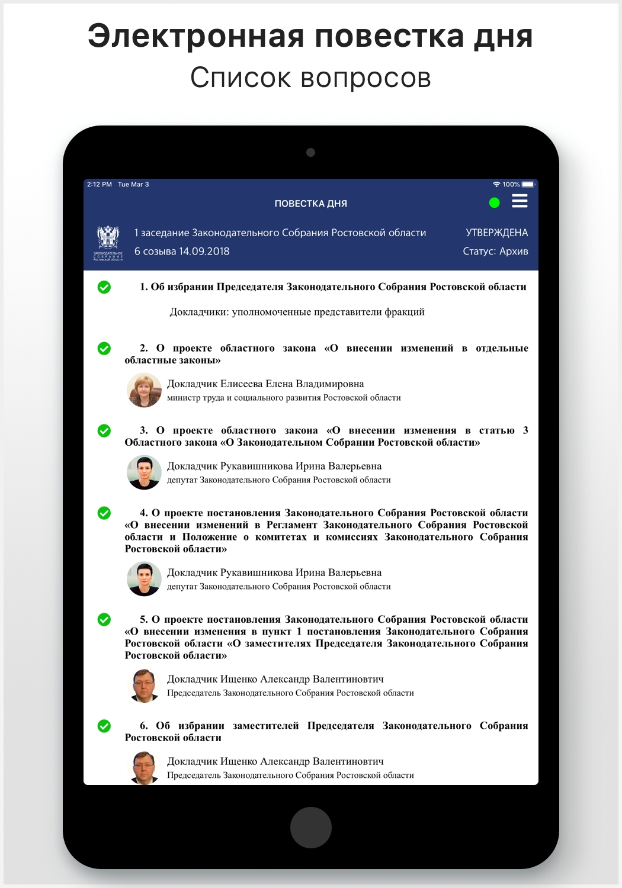
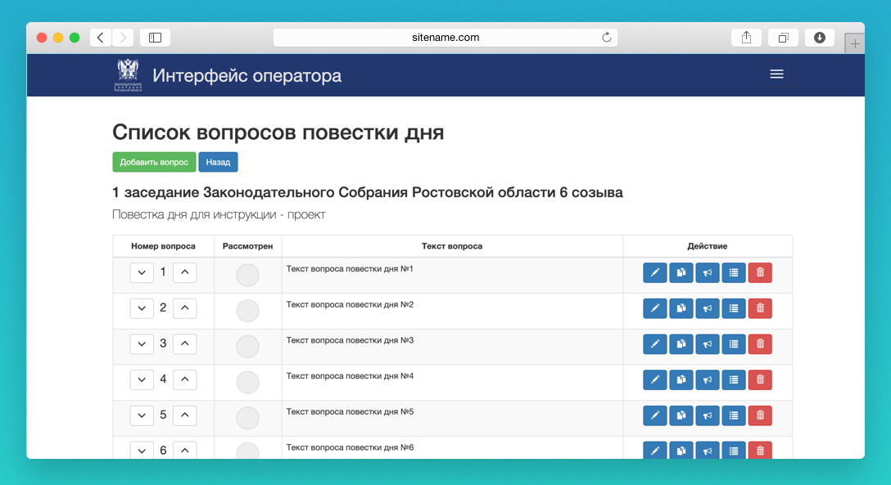
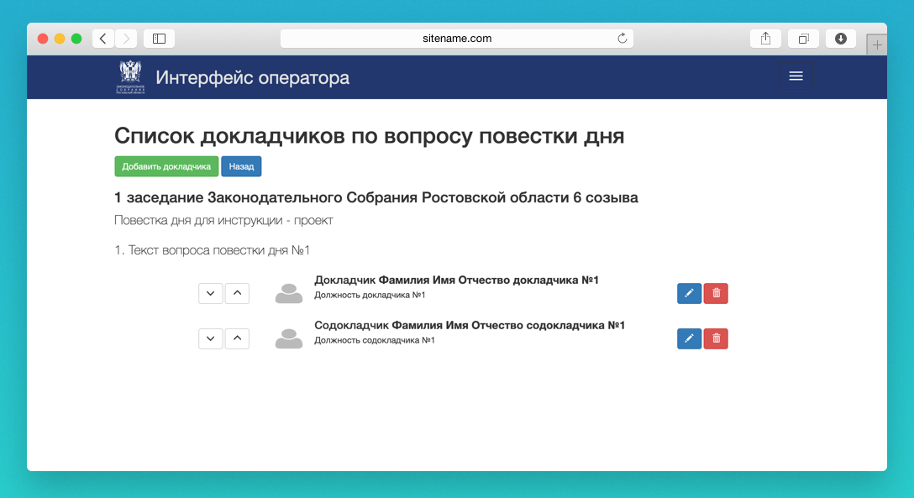

## Электронная повестка дня

Программное обеспечение разрабатывалось для отказа от печати на бумажном носителе документов, необходимых для проведения заседаний. Благодаря данному приложению участиники мероприятия могут ознакомиться со списком вопросов повестки дня, списком докладчиков и всеми необходимыми для работы материалами.

### Мобильное приложение
В рамках проекта было разработано мобильное приложение для планшетных компьютеров iPad. Особое внимание при разработке уделялось отказоустойчивости приложения. Благодаря механизму синхронизации данных, приложение сохраняет работоспособность в случае отсутствия доступа к серверу. Мобильное приложение разрабатывалось с применением: UIKit, Storyboard, Foundation, URLSession, REST API, JSON, GCD.

### Web приложние

Для обеспечения работы мобильного приложения было разработано web приложение, предназначенное для создания списка вопросов повестки дня предстоящего мероприятия и загрузки необходимых материалов, предоставления доступа к повестке дня для приглашенных гостей, не имеющих установленного мобильного приложения, предоставления REST API интерфейса для работы мобильного приложения. Web приложение разрабатывалось с применением: MySQL, PHP/Yii2, Bootstrap, JS (jQuary).

